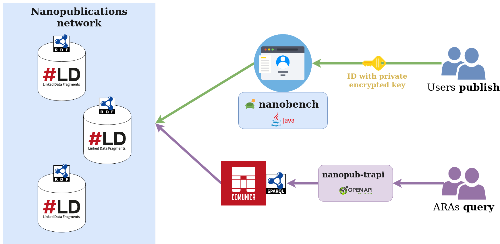

[](https://github.com/MaastrichtU-IDS/nanopub-trapi/actions?query=workflow%3A%22Generate+KGX+graphs+from+RDF%22) [](https://github.com/MaastrichtU-IDS/nanopub-trapi/actions?query=workflow%3A%22Validate+RDF+graphs%22)

This repository provides guidelines to publish Nanopublications as a user with the Nanobench, and query the published Nanopublications network as a researcher searching for answers 💬

> Query the Nanopublication network using SPARQL and Translator Reasoner API at http://nanopub-reasoner-api.137.120.31.102.nip.io/ 



## Publish Nanopublications

Requirements: [Java 8+](https://openjdk.java.net/install/)

Use the [Nanobench 🛋️](https://github.com/vemonet/nanobench) to publish and explore nanopublications using a convenient web UI.

Download the latest release of the Nanobench jar file for the Translator ecosystem by running this command:

```bash
curl -s https://api.github.com/repos/vemonet/nanobench/releases/latest | grep "browser_download_url.*.jar" | cut -d : -f 2,3 | tr -d \" | wget -O ~/.nanopub/nanobench.jar -i -
```

> The jar file is downloaded in your home folder: `~/.nanopub/nanobench.jar`

Run the Nanobench on http://localhost:37373. It will use the `ids_rsa` key in the `.nanopub` folder to authenticate, or guide you to generate one:

```bash
java -jar ~/.nanopub/nanobench.jar -httpPort 37373 -resetExtract
```

> Check the [vemonet/nanobench wiki](https://github.com/vemonet/nanobench/wiki/Add-an-evidence-to-an-association) to get a full tutorial to publish associations.

Templates for the Translator (e.g. "Defining a biomedical association with its context") can be seen and improved in [the MaastrichtU-IDS/nanobench-templates GitHub repository](https://github.com/MaastrichtU-IDS/nanobench-templates/tree/master/templates/translator).

## Generate KGX files from RDF graphs

We use [GitHub Actions workflows](https://github.com/MaastrichtU-IDS/nanopub-trapi/tree/master/.github/workflows) to validate, and transform to KGX TSV files, RDF graphs:

* [`.github/workflows/generate-kgx.yml`](https://github.com/MaastrichtU-IDS/nanopub-trapi/blob/master/.github/workflows/generate-kgx.yml)
* [`.github/workflows/validate-rdf.yml`](https://github.com/MaastrichtU-IDS/nanopub-trapi/blob/master/.github/workflows/validate-rdf.yml)

The RDF graphs are accessible through public SPARQL endpoints:

* [NeuroDKG](https://graphdb.dumontierlab.com/repositories/NeuroDKG)
* [Nanopublications Personal Scientific Knowledge Graph](http://nanopub-sparql.137.120.31.102.nip.io/sparql)

## Query with the Translator Reasoner API 📬

> Work in progress

An Open API is available to query the Nanopublications network using the [ReasonerAPI](https://github.com/NCATSTranslator/ReasonerAPI) standards.

### Query operation

The user sends a [ReasonerAPI](https://github.com/NCATSTranslator/ReasonerAPI) query asking for the predicted targets given: a source, and the relation to predict. The query is a graph with nodes and edges defined in JSON, and uses classes from the [BioLink model](https://biolink.github.io/biolink-model).

See this [ReasonerAPI](https://github.com/NCATSTranslator/ReasonerAPI) query example:

```json
{
  "max_results": 50,
  "message": {
    "query_graph": {
      "nodes": [
        { "id": "n00", "type": "Drug" },
        { "id": "n01", "type": "Disease" }
      ],
      "edges": [
        { "id": "e00", "type": "Association",
          "source_id": "n00", "target_id": "n01" }
      ]
    }
  }
}
```

### Predicates operation

The `/predicates` operation will return the entities and relations provided by this API in a JSON object (following the [ReasonerAPI](https://github.com/NCATSTranslator/ReasonerAPI) specifications).

## Run the SPARQL endpoint and API with Docker

Requirements: [Docker](https://docs.docker.com/get-docker/).

Running using Docker can be convenient if you just want to run the API without installing the package locally, or if it runs in production alongside other services.

2 services are started:

* **A SPARQL endpoint to query the Nanopublications** network of HDT files using `comunica/actor-init-sparql`
* **A Reasoner API to query the SPARQL endpoint**, using https://github.com/MaastrichtU-IDS/d2s-api/tree/develop

Build and start the container with [docker-compose 🐳](https://docs.docker.com/compose/)

```bash
docker-compose up -d
```

> Access the Swagger UI at [http://localhost:8808](http://localhost:8808)

> We use [nginx-proxy](https://github.com/nginx-proxy/nginx-proxy) and [docker-letsencrypt-nginx-proxy-companion](https://github.com/nginx-proxy/docker-letsencrypt-nginx-proxy-companion) as reverse proxy for HTTP and HTTPS in production. You can change the proxy URL and port via environment variables `VIRTUAL_HOST`, `VIRTUAL_PORT` and `LETSENCRYPT_HOST` in the [docker-compose.yml](https://github.com/MaastrichtU-IDS/nanopub-reasoner-api/blob/master/docker-compose.yml) file.

Check the logs:

```bash
docker-compose logs
```

Stop the container:

```bash
docker-compose down
```

# Acknowledgments

Service funded by the [NIH NCATS Translator project](https://ncats.nih.gov/translator/about). 

